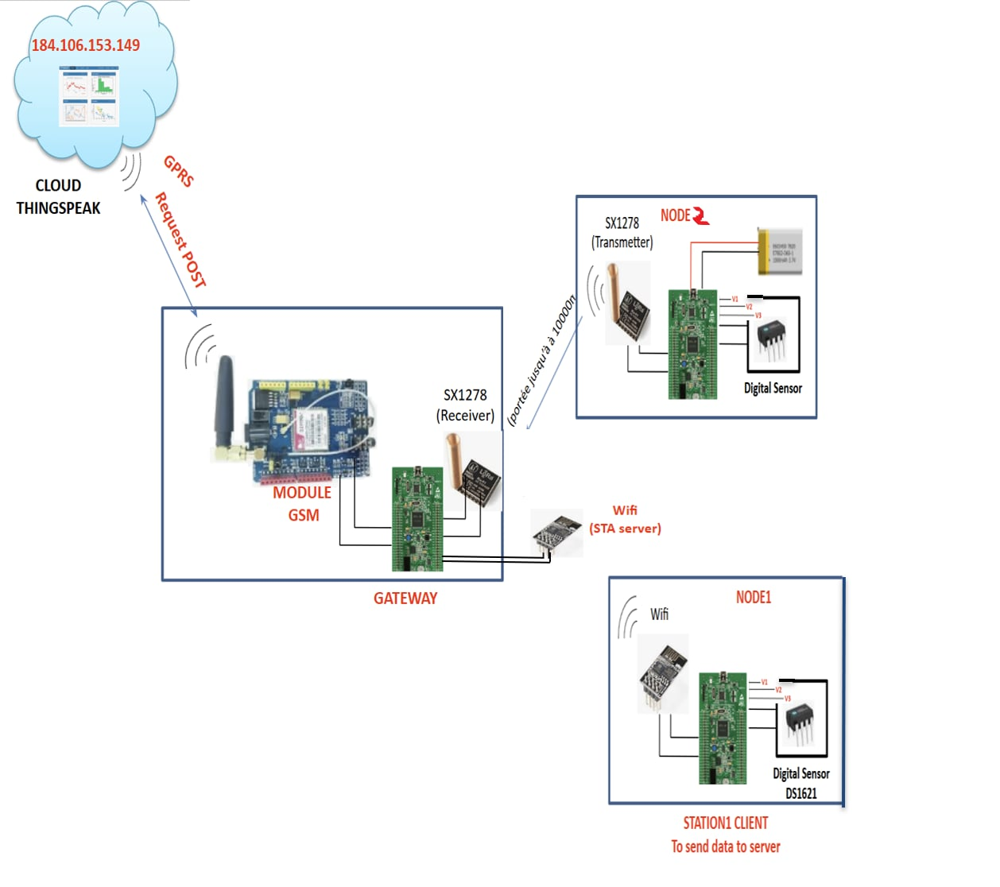

# 📡 STM32 Gateway Project



---

## 📝 General Overview

This project implements a gateway system based on STM32, which centralizes data from two distinct nodes:

1. **Node ESP (Client)**
   - STM32 board with an ESP8266 module in client mode.

2. **Node LoRa**
   - STM32 board with a LoRa SX1278 module for long-range data transmission.

3. **Global Node**
   - Main STM32 board integrating:
     - LoRa module (receiver) to collect data from the LoRa node.
     - GSM module to upload data to the cloud.
     - ESP8266 module (server) to display data via a local web page.

---

## 📦 Project Contents

| Code Name | Main Function | Compiler Compatibility |
| :--- | :--- | :--- |
| `Node_ESP_Client_Code` | Reads data (3 ADC channels + temperature via DS1621) and sends it via the ESP8266 in client mode. | Keil MDK v5 or v6 |
| `Node_LoRa_Transmitter_Code` | Reads data (3 ADC channels + temperature via DS1621) and transmits it via LoRa to the Global Node. | Keil MDK v5 only |
| `Global_Node_Gateway_Code` | Receives data via LoRa and ESP client, serves this data on a local web page via the ESP8266 in server mode, and uploads it to the cloud via GSM. | Keil MDK v5 only |

---

## 🔧 Technical Notes

- Both the Node ESP and Node LoRa codes use the DS1621 temperature sensor.

- **In the LoRa Node code:**
  - In the `main()` function, the following two lines handle the temperature sensor:

    ```c
    DS1621_Init();               // Starts temperature conversion
    temperature = DS1621_Read_Temp();  // Reads the temperature
    ```

- **In the ESP Node code:**
  - In the `main()` function:

    ```c
    DS1621_Init();               // Starts temperature conversion
    ```

  - The temperature is read inside the function:

    ```c
    void ESP_SendDataToServer(const char *serverIP, uint16_t serverPort) {
        ...
        temperature = DS1621_Read_Temp();  // Uncomment if temperature reading is needed
        ...
    }
    ```

- **IMPORTANT:**  
  If the DS1621 sensor is **NOT physically connected**, these lines must be **commented out** in their respective places to prevent errors.

---

## 🙌 Credits

- [Najd Ben Saad](https://www.linkedin.com/in/najd-bensaad/)
- [Khalil Klai](https://www.linkedin.com/in/khalil-klai-918514338/)
- [Yassine Chennenaoui](https://www.linkedin.com/in/yassine-chenennaoui/)
